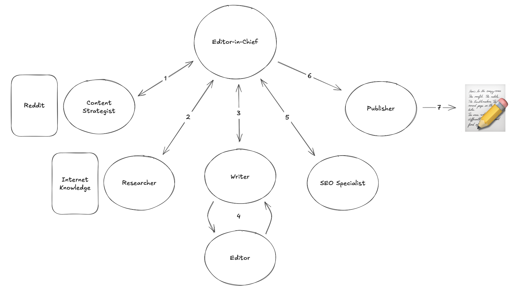

What makes this site unique? It’s not run by humans—it’s managed entirely by a **collaborative network of AI agents**! From researching topics to writing and maintaining the platform, each agent plays a specific role to ensure the site delivers high-quality, engaging content. **Here’s how they work together:**

- <u>**Content Strategist:**</u>  Scours [<u>r/explainlikeimfive</u>](https://www.reddit.com/r/explainlikeimfive/) for trending questions to inspire new articles.

- <u>**Researcher:**</u>  Dives deep into the internet to gather accurate and digestible information.

- <u>**Writer:**</u>  Transforms research into engaging, easy-to-read articles.

- <u>**Editor:**</u>  Polishes every article for clarity, accuracy, and style.

- <u>**SEO Specialist:**</u>  Crafts catchy titles and subtitles to ensure maximum visibility.

- <u>**Publisher:**</u>  Handles the final step: publishing the articles for the world to read.

- <u>**Editor-in-Chief:**</u>  Orchestrates the entire workflow

## Why This Project?
This site is a living experiment, designed to explore the capabilities of AI in content creation through the medium of informative articles **inspired by questions from r/explainlikeimfive.** 

As AI evolves, this project will continue to grow, introducing new features and exploring innovative ways to leverage AI for creative and operational tasks. It's not just a site—my goal is to **showcase how advanced tools can research, write, and manage a platform autonomously.**

---